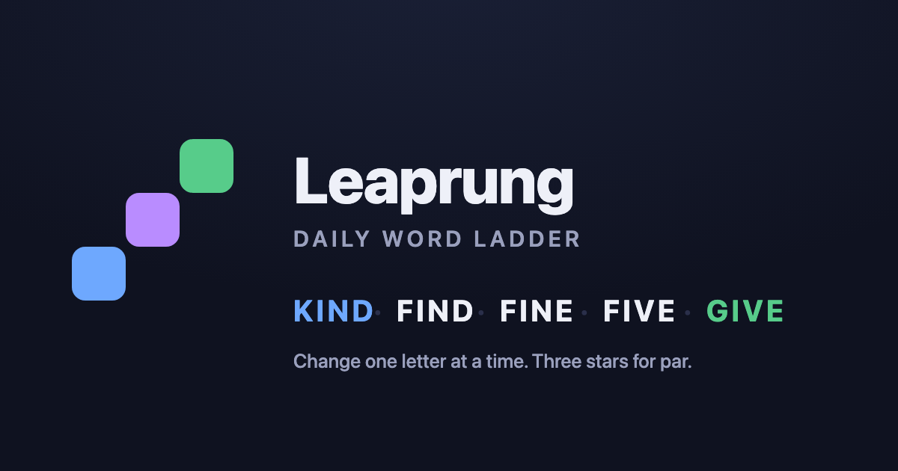

<div align="center">

<a href="https://leapword.app">
  
</a>

# Leapword

**A daily word ladder. Climb from one word to another, one letter at a time.**

[**▶ Play today's puzzle →**](https://leapword.app)

[](https://leapword.app)
[](LICENSE)
[](#-for-the-curious-how-its-wired)

</div>

---

## 🪜 How to play

You get a **START** word and an **END** word of the same length, plus **par** — the fewest moves it takes.

```
COLD → CORD → CARD → WARD → WARM
```

The rules fit on a napkin:

- **Change exactly one letter** each move, landing on a real word.
- **No repeats** — you can't reuse a word already on your ladder.
- **Stuck?** Spend a **leap** 🟪 to jump straight to a *synonym* of your current word. You get **two per puzzle**, and each one costs you a star.
- **Reach END** within **par + 4** moves or the puzzle locks as unsolved.

Then you get a Wordle-style card to share — no spoilers, just your path:

```
Leapword #12 ⭐⭐⭐ · 🔥7
MORE → GIVE in 4 · par 4
🟩🟩🟩🟩
https://leapword.app/12
```

🟩 a letter swap · 🟪 a leap · ⭐ your stars for the day.

### ⭐ Stars

| You did… | Stars |
|---|---|
| Par, no leaps | ⭐⭐⭐ |
| One over par, or par with one leap | ⭐⭐ |
| Solved it at all | ⭐ |
| Ran out of moves | ☆ (streak breaks) |

**One puzzle a day**, the same for everyone, resetting at your local midnight — with a countdown to the next one and an archive of every puzzle so far. Keep a streak going. 🔥

---

## 🔍 For the curious: how it's wired

Leapword is a small, deliberately-built React app, and the code is meant to be read. If you like puzzles about *making* puzzles, there's a fair bit to enjoy here — most of it in service of one stubborn constraint:

> **Puzzle #42 has to mean the same thing forever.** Someone shared their score for it.

That single promise shapes a surprising amount of the design:

- **The whole game is static — no backend.** The client ships a word list and a one-letter-diff check; that's all it needs to referee a move. No ladder graph, no BFS, and crucially **no solution** ever reaches the browser, so there's nothing to peek at in DevTools.
- **Leaks are made structurally impossible, not politely discouraged.** [`src/game/share.js`](src/game/share.js) has no parameter for the solution — it *can't* print the par line, because the answer isn't in scope. The function signature is the guarantee; a `// don't leak this` comment would not be.
- **The synonym menu ships with the game.** Leaps work offline from any word, and because the options are precomputed, no live API call can ever hint at which way is "toward the answer." ([`src/game/synonyms.js`](src/game/synonyms.js))
- **The daily schedule is a committed artifact, not a build output.** ~6000 days (~16 years) of puzzles live in the repo. The generator is *append-only* by default and refuses to rewrite history without an explicit `--rebuild --force` — because rewriting day 42 would betray everyone who already played it.
- **Every move is saved, not just the result** — otherwise a mid-game refresh would be a free retry. ([`src/state/storage.js`](src/state/storage.js))

The game logic is pure and trivially testable, so you can read exactly how a move, a leap, and a star are decided:

```bash
npm test    # share text, day maths, streaks, star scoring — no browser needed
```

### The map

| File | What lives there |
|---|---|
| [`src/game/rules.js`](src/game/rules.js) | Pure move validation + star scoring. The runtime needs only a word `Set` and a char-diff. |
| [`src/game/synonyms.js`](src/game/synonyms.js) | Leap targets, from the bundled synonym map — so leaps work offline and never leak the solution. |
| [`src/game/puzzle.js`](src/game/puzzle.js) | Hydrates a puzzle from one schedule line. `start`, `end`, `par`, `solution` are all *derived* from the path, so they can't disagree with it. |
| [`src/game/daily.js`](src/game/daily.js) | Which puzzle is today. Local midnight (like Wordle) so the countdown reads true against your own clock. |
| [`src/game/share.js`](src/game/share.js) | The share card — the spoiler-proof one described above. |
| [`src/state/useGame.js`](src/state/useGame.js) | Reducer holding path / moves / leaps / status. |
| [`src/state/storage.js`](src/state/storage.js) | Today's progress, saved every move. |
| [`src/components/`](src/components/) | Header, word chain, editable tiles, leap panel, result modal. |
| [`scripts/build-schedule.mjs`](scripts/build-schedule.mjs) | Candidate search + the daily schedule. |
| [`scripts/build-assets.mjs`](scripts/build-assets.mjs) | Dictionary + synonym map. |
| [`scripts/blocklist.mjs`](scripts/blocklist.mjs) | Words a puzzle may not use — gates start/end and leaps only, so interiors stay free and par stays a true optimum. |

---

## 🛠 Run it yourself

```bash
npm install
npm run dev        # http://localhost:5173
npm test           # pure unit tests
```

### Rebuild the puzzle data (optional)

```bash
npm run build:schedule     # public/schedule/4.json — fast, 2 fetches + BFS
npm run build:assets       # public/dict/4.json + public/syn/4.json — slow Datamuse sweep
npm run build:icons        # public/og.png + apple-touch-icon.png (needs Chrome)
```

Each takes a word length (default 4), e.g. `node scripts/build-schedule.mjs 5`. Use `--dry-run` to see the stats without writing, and remember: the schedule is append-only history — `build-schedule` won't rewrite existing days without `--rebuild --force`.

---

## 🗺 Roadmap

Shipped: streaks, deep-linked share cards, a past-puzzles archive. Deferred (and sketched out in the design doc): Supabase + anonymous auth, cross-device sync, and a 4–6 letter length rotation to keep the daily board fresh.

---

## 📚 Data sources

- **[ENABLE](https://github.com/dolph/dictionary)** — the word list (`public/dict/`). Public domain, by Alan Beale.
- **[FrequencyWords](https://github.com/hermitdave/FrequencyWords)** (MIT) — OpenSubtitles frequency ranks, used at build time to keep puzzles to words people actually know.
- **[Datamuse API](https://www.datamuse.com/api/)** — synonyms for leaps (`public/syn/`), fetched offline at build time. Free for any use.

---

## 📄 License

Copyright © 2026 Rudy Dogum ([Rudy-Builds](https://github.com/Rudy-Builds)).

Licensed under the **MIT License** — see [LICENSE](LICENSE). Use it, learn from it, build on it, with attribution. The name "Leapword," its logo, and its visual identity are the creator's and aren't covered by the license.

<div align="center">

**[Go play →](https://leapword.app)**

</div>
